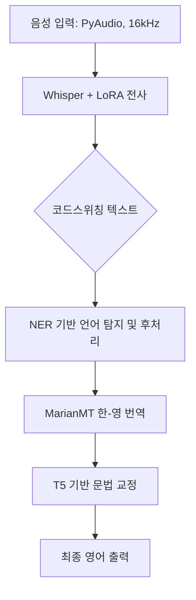

# 🤹 코드스위칭 발화 음성인식 및 번역 파이프라인 (ST_Translate) 🌀

본 프로젝트는 한국어와 영어가 혼용된 **코드스위칭(Code-Switching)** 발화를 실시간으로 인식하고, 이를 자연스러운 영어 문장으로 번역 및 교정하는 통합 파이프라인을 구축하는 것을 목표로 합니다.

---

## 👥 팀 정보
**한국외국어대학교 데이터 분석 학회 DAT**
- **멤버**: 김세린, 김예경, 이지원, 조재표

---

## 🌟 프로젝트 개요
현대 한국어 구어체에서 흔히 발생하는 한국어-영어 혼용(코드스위칭) 현상은 기존 단일 언어 ASR(Automatic Speech Recognition) 모델에서 인식률 저하의 원인이 됩니다. 본 프로젝트는 이러한 문제를 해결하기 위해 Whisper 모델을 LoRA 방식으로 파인튜닝하고, NER 기반 후처리 및 MarianMT 번역, T5 기반 문법 교정 단계를 거쳐 최종적인 영어 번역 결과물을 도출합니다.

---

## 🏗 파이프라인 아키텍처


---

## 📂 프로젝트 구조 및 모듈 설명

### 1. `Speech_Recognition_FineTunning/` - Whisper LoRA 파인튜닝
*   **모델**: `openai/whisper-base`
*   **기법**: PEFT (Parameter-Efficient Fine-Tuning) 중 **LoRA** 적용
*   **설정**: `r=8`, `lora_alpha=32`, `target_modules=["q_proj", "v_proj"]`
*   **학습**: AI Hub 코드스위칭 데이터셋 약 16k 샘플 활용, 3 Epochs 학습

### 2. `Speech_Recognition_CS/` - 코드스위칭 음성인식
*   코드스위칭 발화에 특화된 전사 로직 구현
*   혼용 언어 특성을 반영한 디코딩 파라미터 조정

### 3. `Speech_Recognition_Post_Processing/` - NER 기반 텍스트 후처리
*   **언어 탐지**: 토큰 단위로 한국어/영어를 탐지하여 후처리 경로 결정
*   **매핑**: 한국어 발음대로 표기된 영단어를 원래의 영어 스펠링으로 복원 (Mapping dictionary 활용)

### 4. `Translation/` - 한-영 번역
*   **모델**: `Helsinki-NLP/opus-mt-ko-en` (MarianMT)
*   **로직**: 정규표현식(`regex`)을 사용하여 문장 내 한국어 구문만 추출하여 번역 후, 기존 영어 구문과 재조합하여 정보 손실 방지

### 5. `Grammar_Correction/` - T5 기반 문법 교정
*   **모델**: T5 (Text-to-Text Transfer Transformer)
*   **목적**: 번역 및 조합 과정에서 발생할 수 있는 문법적 부자연스러움을 교정하여 최종 결과물의 완성도 향상

---

## 💻 데모 UI (Streamlit)
`codeswitching_asr_translation_UI.py`를 통해 웹 기반 데모를 실행할 수 있습니다.

*   **실시간 녹음**: PyAudio를 이용한 1~30초 실시간 음성 입력
*   **시각화**: 녹음 진행률 바, 모델 로딩 상태 알림, 타이핑 애니메이션 효과
*   **결과 확인**: 전사된 코드스위칭 문장과 최종 번역된 영어 문장을 확인 가능

---

## 🛠 기술 스택
   

*   **Libraries**: `transformers`, `peft`, `datasets`, `pyaudio`, `sentencepiece`, `numpy`, `re`

---

## 🚀 시작하기

### 설치
```bash
pip install streamlit transformers peft sentencepiece pyaudio numpy torch
```

### 실행
```bash
streamlit run codeswitching_asr_translation_UI.py
```

---

## 📊 데이터셋 정보
*   **출처**: AI Hub 코드스위칭 데이터셋
*   **구성**: 한국어-영어 혼용 대화 데이터 및 음성 파일
*   **전처리**: 결측치(None) 제거, 발음 기반 매핑 데이터 구축, NER 학습용 태깅 등
